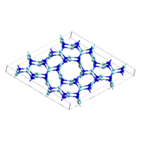

Atsushi Togo
=====================
Computational materials scientist | Program-specific associate professor at `Elements Strategy Initiative for Structural Materials (ESISM) <http://esism.kyoto-u.ac.jp/en/index.html>`_ ,Kyoto University.

|anime|

Associated scientific codes (open source projects)
---------------------------------------------------

* phonopy_: Phonon calculator and analyzer written in Python
* spglib_: Crsytal symmetry finder written in C
* kspclib_: Collection of functions for crystal reciprocal space in C
* niggli_: Determination of Niggli cell written in C
* cogue_: Automation environment for crystal simulations written in
  Python

.. _phonopy: http://phonopy.sf.net
.. _spglib: http://spglib.sf.net
.. _kspclib: https://github.com/atztogo/kspclib
.. _niggli: http://atztogo.github.com/niggli
.. _cogue: https://github.com/atztogo/cogue

Open data project
-------------------

* phonondb_: Phonon calculation database

.. _phonondb: http://phonondb.mtl.kyoto-u.ac.jp/

Publications
-------------

*  "First principles phonon calculations in materials science"
     Atsushi Togo and Isao Tanaka,
     Scr. Mater., **108**, 1-1-5 (2015)

*  "Influence of the exchange-correlation functional on the quasi-harmonic lattice dynamics of II-VI semiconductors"
     Jonathan M. Skelton, Davide Tiana, Stephen C. Parker, Atsushi Togo, Isao Tanaka, Aron Walsh,
     J. Chem. Phys., **143**, 064710-1-14 (2015)

*  "Distributions of phonon lifetimes in Brillouin zones"
     Atsushi Togo, Laurent Chaput, and Isao Tanaka,
     Phys. Rev. B, **91**, 094306-1-31 (2015)

*  "First principles study of thermal conductivity cross-over in nanostructured zinc-chalcogenides"
     Ankita Katre, Atsushi Togo, Isao Tanaka, and Georg K. H. Madsen,
     J. Appl. Phys., **117**, 045102-1-6 (2015)

*  "Phonon softening in paramagnetic body-centered cubic iron and relationship with phase transition"
     Yuji Ikeda, Atsuto Seko, Atsushi Togo, and Isao Tanaka,
     Phys. Rev. B, **90**, 134106-1-7 (2014)

*  "Ab initio ORTEP drawings: a case study of N-based molecular crystals with different chemical nature"
     Volker L. Deringer, Ralf P. Stoffel, Atsushi Togo, Bernhard Eck, Martin Mevencd, and Richard Dronskowski,
     Cryst. Eng. Comm., **16**, 10907-1-9 (2014)

*  "Thermal physics of the lead chalcogenides PbS, PbSe, and PbTe from first principles"
     Jonathan M. Skelton, Stephen C. Parker, Atsushi Togo, Isao Tanaka, and Aron Walsh,
     Phys. Rev. B, **89**, 205203-1-10 (2014)

*  "Inversion Symmetry Breaking by Oxygen Octahedral Rotations in the Ruddlesden-Popper NaRTiO4 Family"
     Hirofumi Akamatsu, Koji Fujita, Toshihiro Kuge, Arnab Sen Gupta, Atsushi Togo, Shiming Lei, Fei Xue, Greg Stone, James M. Rondinelli, Long-Qing Chen, Isao Tanaka, Venkatraman Gopalan, and Katsuhisa Tanaka,
     Phys. Rev. Lett., **112**, 187602-1-5 (2014)

*  "High-pressure torsion of titanium at cryogenic and room temperatures: Grain size effect on allotropic phase transformations"
     Kaveh Edalati, Takeshi Daio, Makoto Arita, Seungwon Lee, Zenji Horita, Atsushi Togo, and Isao Tanaka,
     Acta Materialia, **68**, 207–1-7 (2014)
   
*  "Evolution of crystal structures in metallic elements"
     Atsushi Togo and Isao Tanaka,
     Phys. Rev. B, **87**, 184104-1-6 (2013)

*  "Neutron diffraction measurements and first-principles study of thermal motion of atoms in select Mn+1AXn and binary MX transition-metal carbide phases"
     Nina J. Lane, Sven C. Vogel, Gilles Hug, Atsushi Togo, Laurent Chaput, Lars Hultman, and Michel W. Barsoum,
     Phys. Rev. B, **86**, 214301-1-9 (2012)

*  "First-order Raman scattering of the MAX phases: Ti2AlN, Ti2AlC0.5N0.5, Ti2AlC, (Ti0.5V0.5)2AlC, V2AlC, Ti3AlC2, and Ti3GeC2"
     Volker Presser, Michael Naguib, Laurent Chaput, Atsushi Togo, Gilles Hug, and Michel W. Barsoum,
     J. Raman Spectrosc., **43**, 168-1-5 (2012)
   
*  "Phonon-phonon interactions in transition metals"
     Laurent Chaput, Atsushi Togo, Isao Tanaka, and Gilles Hug,
     Phys. Rev. B, **84**, 094302-1-6 (2011)

*  "Electronic structures of dynamically stable As2O3, Sb2O3, and Bi2O3 crystal polymorphs"
     Akifumi Matsumoto, Yukinori Koyama, Atsushi Togo, Minseok Choi, and Isao Tanaka,
     Phys. Rev. B, **83**, 214110-1-10 (2011)

*  "First-principles phonon calculations of thermal expansion in Ti3SiC2, Ti3AlC2, and Ti3GeC2"
     Atsushi Togo, Laurent Chaput, Isao Tanaka, Gilles Hug,
     Phys. Rev. B, **81**, 174301-1-6 (2010)

*  "Doping of hexagonal boron nitride via intercalation: A theoretical prediction"
     Fumiyasu Oba, Atsushi Togo, Isao Tanaka, Kenji Watanabe, and Takashi Taniguchi,
     Phys. Rev. B, **81**, 075125-1-6 (2010)

*  "Anisotropic phonon density of states in FePt nanoparticles with L10 structure"
     Yoshinori Tamada, Ryo Masuda, Atsushi Togo, Shinpei Yamamoto, Yoshitaka Yoda, Isao Tanaka, Makoto Seto, Saburo Nasu, and Teruo Ono,
     Phys. Rev. B **81**, 132302-1-4 (2010)
     
*  "First-principles calculations of the ferroelastic transition between rutile-type and CaCl2-type SiO2 at high pressures"
     Atsushi Togo, Fumiyasu Oba, and Isao Tanaka,
     Phys. Rev. B, **78**, 134106-1-9 (2008)

*  "Defect energetics in ZnO: A hybrid Hartree-Fock density functional study"
     Fumiyasu Oba, Atsushi Togo, Isao Tanaka, Joachim Paier, and Georg
     Kresse,
     Phys. Rev. B, **77**, 245202-1-6 (2008)

*  "Transition pathway of CO2 crystals under high pressures"
     Atsushi Togo, Fumiyasu Oba, and Isao Tanaka,
     Phys. Rev. B, **77**, 184101-1-5 (2008)

*  "Structure and stability of homologous series of tin oxides"
     Atsuto Seko, Atsushi Togo, Fumiyasu. Oba, and Isao. Tanaka,
     Phys. Rev. Lett., **100**, 045702-1-4 (2008)

*  "First-principles calculations of native defects in tin monoxide"
     Atsushi Togo, Fumiyasu. Oba, Isao. Tanaka, and Kazuyoshi Tatsumi,
     Phys. Rev. B., **74**, 195128-1-8 (2006)

Contact
-------

* atz.togo@gmail.com (for code development), togo.atsushi@gmail.com
* https://github.com/atztogo
